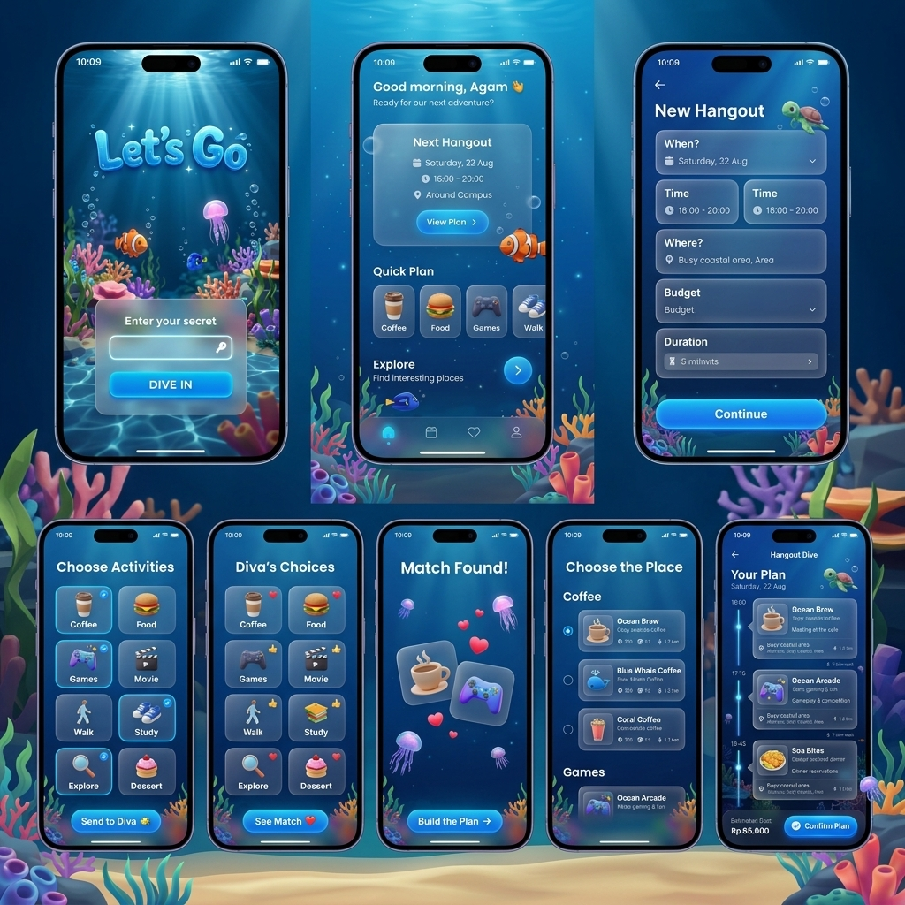
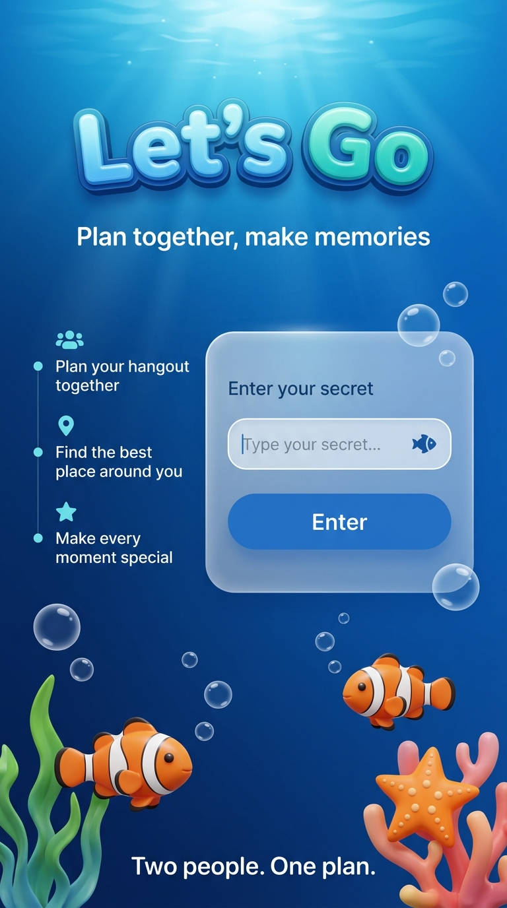
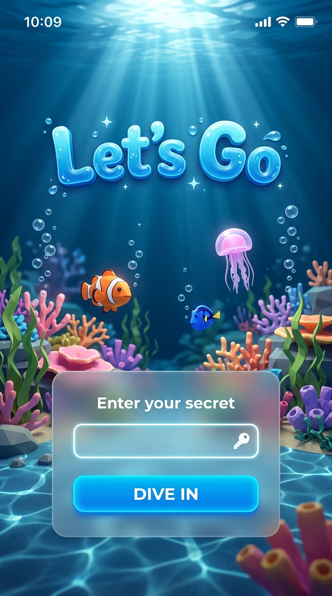
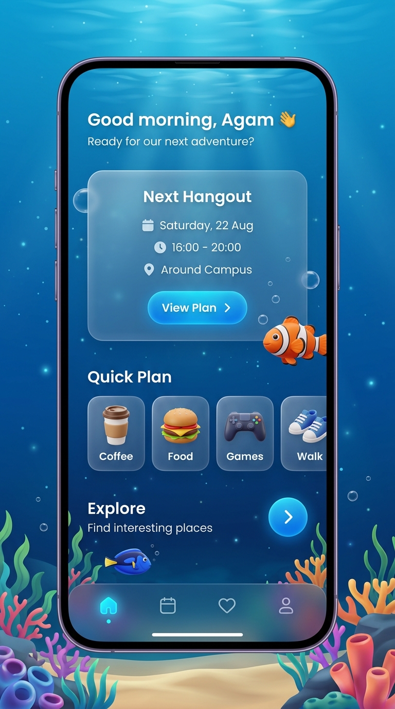
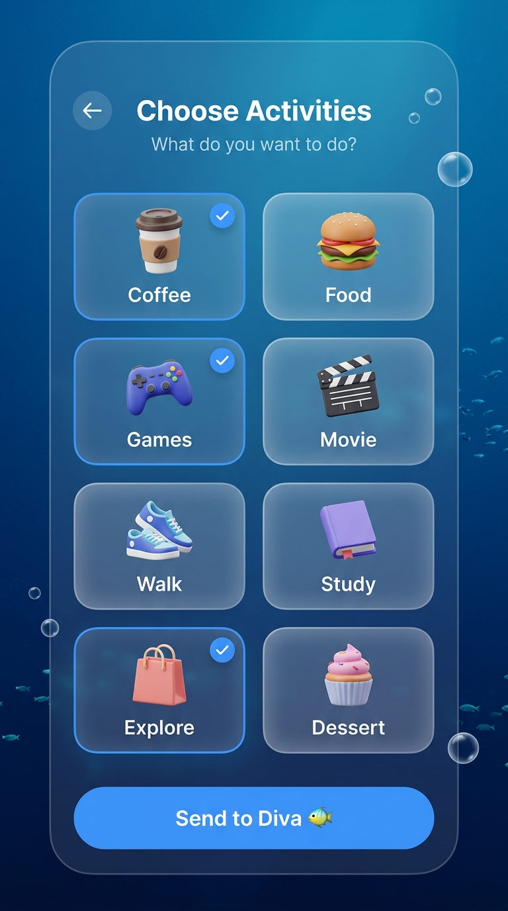
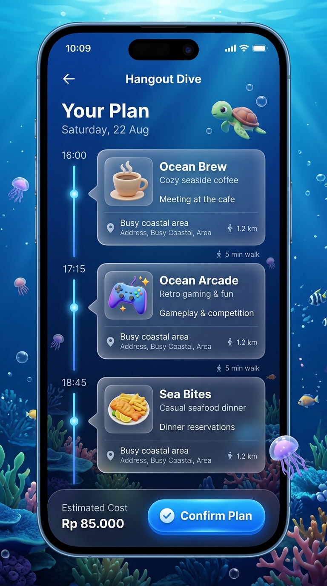
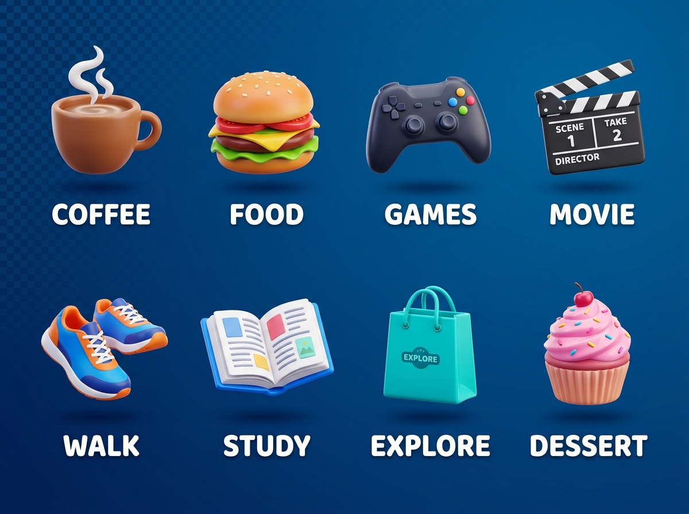
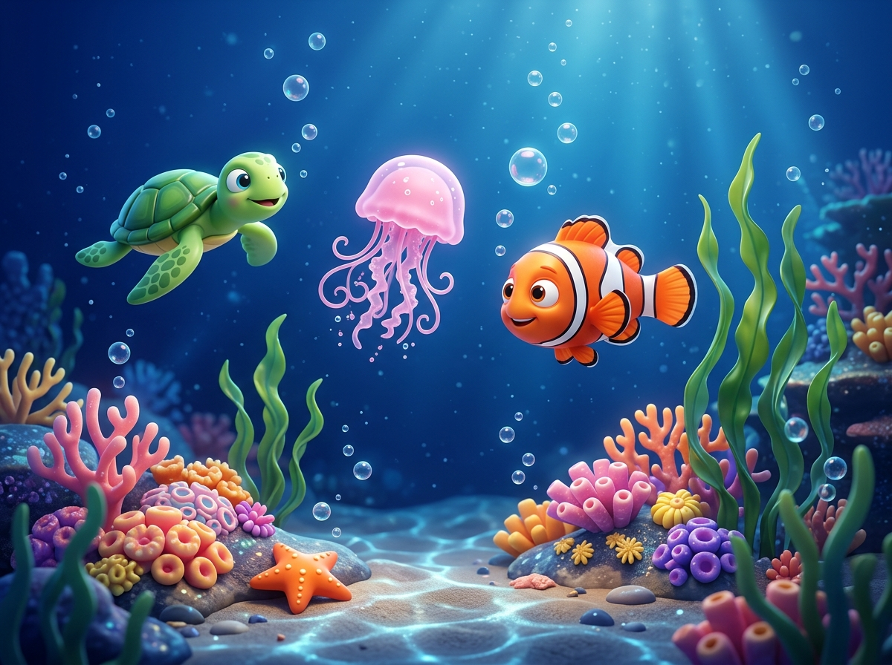
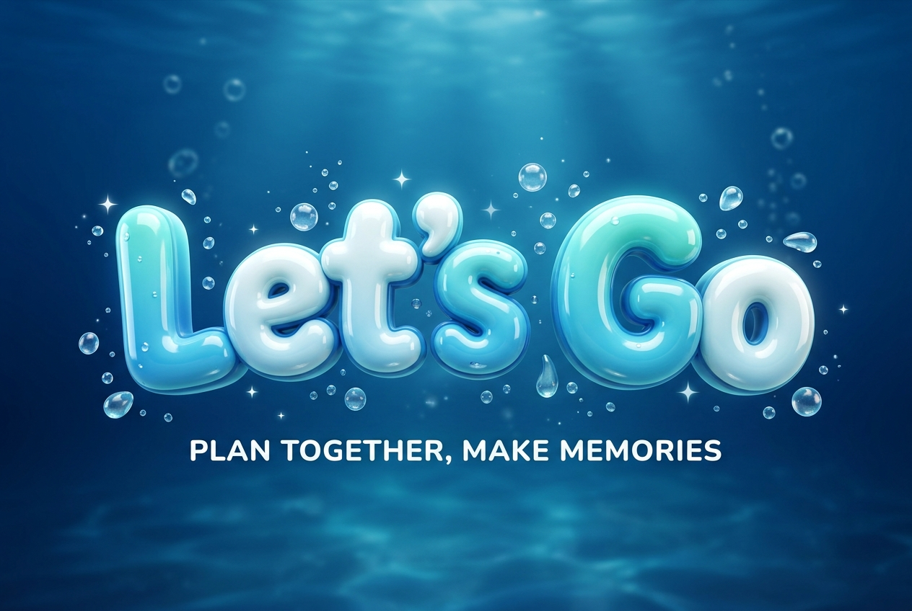

# Let's Go — UI/UX Design Specification

**Version:** 2.0  
**Theme:** Immersive 3D Ocean (React Three Fiber)  
**Users:** Agam & Diva  
**Currency:** Indonesian Rupiah (Rp)  
**Platform:** Responsive Web (Next.js + TypeScript)

---

## Visual Direction

The design follows a **bright, playful, immersive 3D underwater world** — vibrant ocean blues, real-time WebGL ocean scenes powered by React Three Fiber, cute 3D-rendered creatures, glassmorphism UI cards layered over live 3D backgrounds, and a lively Pixar-meets-premium-app atmosphere.

### Full Screen Showcase



### Key Mockups











### 3D Asset References







---

## 1. Design System

### 1.1 Color Palette

#### Backgrounds — Vibrant Ocean Blues

| Token | Hex | Usage |
|-------|-----|-------|
| `--bg-deep` | `#062040` | Deepest background / R3F scene fog color |
| `--bg-ocean` | `#0a3068` | Primary page background |
| `--bg-mid` | `#0e4a8a` | Mid-depth sections |
| `--bg-shallow` | `#1a6ab5` | Lighter areas, header highlights |
| `--bg-surface` | `#2080cc` | Upper water, interactive surfaces |
| `--bg-light` | `#40a0e0` | Light water accent areas |

#### Primary — Bright Blue

| Token | Hex | Usage |
|-------|-----|-------|
| `--primary` | `#2196F3` | Buttons, links, active states |
| `--primary-bright` | `#42A5F5` | Button hover, highlights |
| `--primary-dark` | `#1565C0` | Pressed state |
| `--primary-glow` | `rgba(33, 150, 243, 0.4)` | Glow effects, R3F point lights |
| `--primary-subtle` | `rgba(33, 150, 243, 0.15)` | Tinted backgrounds |

#### Accent — Teal / Cyan

| Token | Hex | Usage |
|-------|-----|-------|
| `--accent-teal` | `#00BCD4` | Secondary highlights, active nav |
| `--accent-cyan` | `#4DD0E1` | Icon accents, badges |
| `--accent-light` | `#80DEEA` | Subtle accent tints |

#### Warm Accents

| Token | Hex | Usage |
|-------|-----|-------|
| `--warm-coral` | `#FF6B6B` | Hearts, love reactions |
| `--warm-orange` | `#FF8A65` | Badges, alerts |
| `--warm-gold` | `#FFB74D` | Stars, ratings |
| `--warm-pink` | `#F48FB1` | Decorative accents |

#### Text

| Token | Hex | Usage |
|-------|-----|-------|
| `--text-primary` | `#FFFFFF` | Headings, primary text |
| `--text-secondary` | `#B0D4F1` | Body text, descriptions |
| `--text-muted` | `#6A9EC8` | Placeholders, disabled, captions |
| `--text-on-button` | `#FFFFFF` | Text on primary buttons |

#### Semantic

| Token | Hex | Usage |
|-------|-----|-------|
| `--success` | `#4CAF50` | Confirmed, completed |
| `--error` | `#EF5350` | Invalid secret, form errors |
| `--warning` | `#FFB74D` | Pending states |
| `--info` | `#4DD0E1` | Informational hints |

#### Glassmorphism

| Token | Value | Usage |
|-------|-------|-------|
| `--glass-bg` | `rgba(255, 255, 255, 0.1)` | Glass card background |
| `--glass-bg-strong` | `rgba(255, 255, 255, 0.15)` | Elevated glass cards |
| `--glass-border` | `rgba(255, 255, 255, 0.2)` | Glass card border |
| `--glass-blur` | `blur(20px)` | Backdrop filter |

---

### 1.2 Typography

#### Font Families

| Role | Font | Source |
|------|------|--------|
| Headings | **Outfit** | Google Fonts |
| Body | **Inter** | Google Fonts |
| Time displays | **JetBrains Mono** | Google Fonts |

#### Type Scale

| Token | Size | Weight | Font | Usage |
|-------|------|--------|------|-------|
| `--text-display` | 48px / 3rem | 700 | Outfit | Hero text (Access page) |
| `--text-h1` | 32px / 2rem | 700 | Outfit | Page titles |
| `--text-h2` | 24px / 1.5rem | 600 | Outfit | Section headings |
| `--text-h3` | 20px / 1.25rem | 600 | Outfit | Card titles |
| `--text-body` | 16px / 1rem | 400 | Inter | Default body text |
| `--text-body-sm` | 14px / 0.875rem | 400 | Inter | Secondary text |
| `--text-caption` | 12px / 0.75rem | 500 | Inter | Labels, metadata |
| `--text-time` | 20px / 1.25rem | 500 | JetBrains Mono | Time displays |

#### Mobile Adjustments

- `--text-display` → 36px
- `--text-h1` → 26px
- `--text-h2` → 20px

---

### 1.3 Spacing, Borders & Shadows

#### Spacing (4px base)

`--space-1` (4px) through `--space-16` (64px)

#### Breakpoints

| Name | Range | Layout |
|------|-------|--------|
| Mobile | 0–767px | Single column, bottom nav |
| Tablet | 768–1023px | Single column, collapsed nav |
| Desktop | 1024px+ | Centered content (max 720px), top nav |

#### Borders & Shadows

| Token | Value |
|-------|-------|
| `--radius-sm` | 8px |
| `--radius-md` | 12px |
| `--radius-lg` | 16px |
| `--radius-xl` | 24px |
| `--radius-full` | 9999px |
| `--shadow-card` | `0 8px 32px rgba(0, 0, 0, 0.25)` |
| `--shadow-glow` | `0 0 20px rgba(33, 150, 243, 0.3)` |
| `--shadow-glow-strong` | `0 0 40px rgba(33, 150, 243, 0.5)` |
| `--border-glass` | `1px solid rgba(255, 255, 255, 0.2)` |

---

### 1.4 Component Specifications

#### Buttons

**Primary Button**

```
Background:      Linear gradient(135deg, --primary, --primary-bright)
Text:            White, Inter 16px, weight 600
Padding:         14px 32px
Border-radius:   --radius-full (pill shape)
Shadow:          --shadow-glow
Hover:           brightness(1.1), shadow → --shadow-glow-strong
Active:          scale(0.97)
Transition:      all 0.2s ease
```

**Secondary Button**

```
Background:      --glass-bg
Border:          --glass-border
Text:            White
Backdrop-filter: blur(12px)
Hover:           background → --glass-bg-strong
```

#### Input Fields

```
Background:      rgba(255, 255, 255, 0.12)
Border:          1px solid rgba(255, 255, 255, 0.15)
Text:            White
Placeholder:     --text-muted
Padding:         14px 16px
Border-radius:   --radius-md (12px)
Focus:           border → rgba(255, 255, 255, 0.35),
                 box-shadow: 0 0 0 3px rgba(33, 150, 243, 0.2)
```

#### Cards (Glass)

```
Background:      --glass-bg
Border:          --glass-border
Backdrop-filter: --glass-blur
Border-radius:   --radius-lg (16px)
Padding:         20px–24px
Shadow:          --shadow-card
```

#### Activity Chips (2-column grid)

```
Background:      --glass-bg
Border:          --glass-border
Border-radius:   --radius-lg (16px)
Padding:         20px
Icon:            3D PNG image, 64px × 64px, centered
Label:           --text-body, centered below icon

Selected state:
  Border:        2px solid --primary
  Shadow:        --shadow-glow
  Badge:         Blue circle checkmark (top-right corner)

Deselected state:
  Default appearance, no badge
```

#### Star Rating

```
Empty:           --text-muted
Filled:          --warm-gold (#FFB74D)
Size:            28px
Hover:           scale(1.15) on individual star
```

---

## 2. React Three Fiber — 3D Architecture

> [!IMPORTANT]
> The entire underwater world is rendered as a **live WebGL scene** using React Three Fiber (`@react-three/fiber`), not pre-rendered static images. The 3D canvas sits as a **fixed background layer** behind the DOM-based UI, creating a layered glass-over-ocean effect.

### 2.1 Layer Architecture

```
┌────────────────────────────────────────────┐
│  z-index: 2  —  DOM UI Layer              │
│  (Glass cards, buttons, inputs, nav)       │
│  pointer-events: auto                      │
├────────────────────────────────────────────┤
│  z-index: 1  —  R3F Canvas Layer          │
│  (3D ocean scene, fish, bubbles, coral)    │
│  pointer-events: none (default)            │
│  position: fixed, inset: 0                 │
├────────────────────────────────────────────┤
│  z-index: 0  —  CSS Gradient Fallback     │
│  (Shows while R3F loads / on low-end)      │
└────────────────────────────────────────────┘
```

The R3F `<Canvas>` is mounted **once** at the app root as a fixed background. The scene composition changes based on the current route via a scene manager.

### 2.2 Core Dependencies

| Package | Version | Purpose |
|---------|---------|---------|
| `@react-three/fiber` | ^8.x | React renderer for Three.js |
| `@react-three/drei` | ^9.x | Helpers: `Environment`, `Float`, `useGLTF`, `CausticsMaterial` |
| `@react-three/postprocessing` | ^2.x | Bloom, god rays, depth of field |
| `three` | ^0.160+ | Core 3D engine |
| `three-stdlib` | latest | Additional materials & geometries |

### 2.3 Scene Structure

```tsx
// Root layout — mounted once
<div className="app-root">
  {/* Fixed 3D background */}
  <Canvas
    className="ocean-canvas"
    camera={{ position: [0, 0, 5], fov: 60 }}
    dpr={[1, 1.5]}
    gl={{ antialias: true, alpha: true }}
    style={{ position: 'fixed', inset: 0, zIndex: 1 }}
  >
    <Suspense fallback={null}>
      <OceanSceneManager currentRoute={route} />
    </Suspense>
  </Canvas>

  {/* DOM UI on top */}
  <main className="ui-layer" style={{ position: 'relative', zIndex: 2 }}>
    {children}
  </main>
</div>
```

### 2.4 OceanSceneManager

The scene manager controls which 3D elements are active based on the current route:

```tsx
function OceanSceneManager({ currentRoute }) {
  const intensity = SCENE_CONFIG[currentRoute]

  return (
    <>
      {/* Always present */}
      <OceanLighting intensity={intensity} />
      <OceanFog />
      <FloatingParticles count={intensity.particles} />

      {/* Conditional by intensity */}
      {intensity.caustics && <CausticsPlane />}
      {intensity.bubbles > 0 && <BubbleSystem count={intensity.bubbles} />}
      {intensity.fish > 0 && <SwimmingFish count={intensity.fish} />}
      {intensity.seabed && <SeabedScene />}
      {intensity.creatures && <DecorativeCreatures types={intensity.creatures} />}

      {/* Post-processing */}
      <EffectComposer>
        <Bloom luminanceThreshold={0.6} intensity={0.4} />
        {intensity.godRays && <GodRays />}
      </EffectComposer>
    </>
  )
}
```

### 2.5 3D Model Assets (`.glb`)

All 3D models use `.glb` format (compressed glTF binary), loaded via `useGLTF` from drei.

#### Ocean Creatures

| Model | File | Poly Budget | Animation |
|-------|------|-------------|-----------|
| Clownfish | `clownfish.glb` | ~2,000 tris | Swim cycle (tail + fins), path follow |
| Blue Tang | `blue-tang.glb` | ~1,800 tris | Swim cycle, schooling behavior |
| Sea Turtle | `turtle.glb` | ~3,000 tris | Slow swim cycle, flipper rotation |
| Jellyfish | `jellyfish.glb` | ~1,500 tris | Pulse animation (bell contraction), tentacle sway |
| Starfish | `starfish.glb` | ~800 tris | Static, slight rotation |

#### Seabed Elements

| Model | File | Poly Budget | Animation |
|-------|------|-------------|-----------|
| Coral cluster A | `coral-a.glb` | ~2,500 tris | None (static) |
| Coral cluster B | `coral-b.glb` | ~2,000 tris | None (static) |
| Seaweed bundle | `seaweed.glb` | ~1,200 tris | Vertex shader sway |
| Rock formation | `rocks.glb` | ~1,500 tris | None (static) |
| Sandy floor | Procedural plane | — | Caustics shader projection |

#### Logo

| Model | File | Poly Budget | Animation |
|-------|------|-------------|-----------|
| "Let's Go" 3D text | `logo.glb` | ~5,000 tris | Gentle float + bubble emission |

### 2.6 Procedural Elements (No Models Required)

These are generated with Three.js geometry and shaders — no `.glb` files needed:

| Element | Implementation | Detail |
|---------|---------------|--------|
| **Bubbles** | `SphereGeometry` + `MeshPhysicalMaterial` (transmission, IOR) | Transparent, refractive, rise with sine sway |
| **Particles** | `Points` + `BufferGeometry` with custom `ShaderMaterial` | Tiny glowing dots, slow drift |
| **Light rays** | `VolumetricSpotLight` or custom god-ray shader | Animated cones from surface |
| **Caustics** | Custom shader on floor plane | Animated Voronoi/cellular pattern |
| **Water surface** | `PlaneGeometry` + animated normal map | Visible from below, ripple distortion |

### 2.7 Shaders

#### Caustics Shader (Floor)

```glsl
// Fragment shader — projects animated caustic pattern on sandy floor
uniform float uTime;
uniform vec3 uColor; // --accent-cyan

void main() {
  vec2 uv = vUv * 8.0;
  float caustic = voronoiPattern(uv + uTime * 0.05);
  caustic = smoothstep(0.3, 0.7, caustic);
  vec3 color = mix(vec3(0.04, 0.12, 0.25), uColor, caustic * 0.35);
  gl_FragColor = vec4(color, 1.0);
}
```

#### Seaweed Vertex Shader

```glsl
// Vertex shader — organic swaying motion anchored at base
uniform float uTime;
attribute float aOffset;

void main() {
  vec3 pos = position;
  float swayAmount = pos.y * 0.15; // more sway at top
  pos.x += sin(uTime * 0.8 + aOffset) * swayAmount;
  pos.z += cos(uTime * 0.6 + aOffset * 0.5) * swayAmount * 0.5;
  gl_Position = projectionMatrix * modelViewMatrix * vec4(pos, 1.0);
}
```

#### Bubble Material

```tsx
<meshPhysicalMaterial
  transmission={0.95}
  roughness={0.05}
  thickness={0.5}
  ior={1.33}           // water refraction index
  envMapIntensity={0.8}
  color="#80DEEA"
  transparent
  opacity={0.3}
/>
```

---

## 3. Screen Specifications

---

### 3.1 Access Page — `/`

> Visual reference: Login mockups above

#### Layout

- **R3F Background:** Full immersive underwater scene — seabed with coral, rocks, seaweed, swimming fish, rising bubbles, caustic light on floor, volumetric god rays from surface
- **Top:** 3D "Let's Go" logo rendered in R3F scene (floating, with bubble particles emitting from letters)
- **Left side (desktop):** Feature bullets with icons — "Plan your hangout together", "Find the best place around you", "Make every moment special"
- **Center:** Frosted glass card (DOM overlay) containing:
  - "Enter your secret" heading
  - Password input with fish icon
  - "Dive In" primary button (full width within card)
- **Bottom:** "Two people. One plan." tagline

#### R3F Scene — HEAVY Intensity

| Element | Count | Behavior |
|---------|-------|----------|
| Bubbles | 15–20 | Rise from seabed, sine sway ±20px, 8–15s duration |
| Clownfish | 2 | Swim paths across scene, 20–35s crossing |
| Blue tang | 1 | Slow swim in background |
| Jellyfish | 1 | Float with pulsing bell, drift upward slowly |
| Sea turtle | 1 | Slow pass, visible briefly then exits |
| Seaweed | 4–6 bundles | Vertex shader sway ±5° |
| Coral | 2–3 clusters | Static, seabed decoration |
| Particles | 30–50 | Tiny glowing dots, slow drift |
| Light rays | 3–4 | Volumetric cones from surface, slow rotation |
| Caustics | Floor plane | Animated Voronoi pattern |
| Water surface | Top plane | Visible from below, ripple normals |

#### States

| State | Behavior |
|-------|----------|
| Default | Input empty, button visible |
| Typing | Button brightens |
| Loading | Button shows spinner, input disabled |
| Error | Input border → red, shake animation, "Invalid secret" message |
| Success | Brief glow pulse, R3F camera pushes forward (dive effect) → redirect `/home` |

---

### 3.2 Home Page — `/home`

> Visual reference: Home screen mockup above

#### Layout

- **Header:** "Good morning, Agam 👋" / "Ready for our next adventure?"
- **Next Hangout Card:** Glass card showing date, time, location, with "View Plan >" button
- **Quick Plan:** Horizontal row of activity icon chips (3D PNGs in DOM cards) — Coffee, Food, Games, Walk — tap to create hangout with that activity pre-selected
- **Explore:** "Find interesting places" with arrow button
- **Recent Adventures:** Compact list of past hangouts with ratings

#### R3F Scene — LIGHT Intensity

| Element | Count | Behavior |
|---------|-------|----------|
| Particles | 8–12 | Slow upward drift |
| Clownfish | 1 | Small, swims near edge of view |
| Bubbles | 3–5 | Sparse, slow rise |
| Caustics | None | — |
| Light rays | None | — |

#### States

| State | Behavior |
|-------|----------|
| No upcoming | "No plans yet — let's fix that! 🐠" with Create button |
| Pending (for you) | "Diva planned something! 🐙" with "Respond" button |
| Pending (waiting) | "Waiting for Diva... 🐢" |
| Confirmed | "CONFIRMED ✓" in `--success` |
| Today | Card pulses, "TODAY! 🎉" badge, "Start Adventure →" button |

---

### 3.3 Create Hangout — `/hangouts/new`

#### Layout

Single scrollable form with sections:

```
← Back                    NEW HANGOUT

🗓️ WHEN?          [ Saturday, 22 Aug ]
⏰ TIME            [ 16:00 ]  to  [ 20:00 ]
📍 WHERE?          [ Around campus... ]
💰 BUDGET          [ Rp 100.000 ]
⏱️ DURATION        [ ~4 hours ]  (auto-calculated)

📝 NOTES (optional)
[ _________________________ ]

              [ Continue → ]
```

- Glass card sections for each field group
- Budget input prefixed with "Rp", formatted with dots (100.000)
- Duration auto-calculated from time range

#### R3F Scene — MINIMAL Intensity

| Element | Count | Behavior |
|---------|-------|----------|
| Particles | 5–8 | Slow drift |
| Turtle | 1 | Small, floating near top-right corner |
| Bubbles | 0 | — |

#### Validation

| Field | Rule |
|-------|------|
| Date | Required, today or future |
| Start / End time | Required, end > start |
| Area | Required, min 3 chars |
| Budget | Optional, numeric |
| Notes | Optional, max 500 chars |

---

### 3.4 Activity Selection — `/hangouts/[id]/activities`

> Visual reference: Activities screen mockup above

#### Creator View

- Title: "Choose Activities" / "What do you want to do?"
- 2-column grid of 8 activity chips, each with 3D icon PNG (64px) in DOM
- Tap to toggle selection — selected shows blue border + checkmark badge
- Counter: "3 activities selected"
- Button: "Send to Diva 🐠"

#### Responder View (Diva sees this)

- Title: "AGAM'S PLAN 🐙"
- Hangout details summary (date, time, area)
- Activity list (only creator's selections), each with reaction toggle:

| Tap State | Icon | Visual |
|-----------|------|--------|
| Love | ❤️ | Coral border tint, `--warm-coral` bg |
| Like | 👍 | Teal border tint, `--accent-teal` bg |
| Pass | 👎 | Dimmed, slight red border |

- Button: "Submit Choices 🐚"

#### Matching Logic

Match = Creator selected + Responder chose ❤️ or 👍

#### R3F Scene — LIGHT Intensity

| Element | Count | Behavior |
|---------|-------|----------|
| Particles | 8–10 | Slow drift |
| Bubbles | 3–5 | Sparse |

---

### 3.5 Match Results — `/hangouts/[id]/matches`

#### Layout

- Title: "Match Found! 🎉" (with glow pulse animation)
- Matched activities shown in highlighted glass cards with both users' reactions
- Large 3D icons for matched activities (coffee cup, game controller, etc.)
- Unmatched activities shown dimmed below a divider
- Button: "Build the Plan →"

#### R3F Scene — MEDIUM Intensity

| Element | Count | Behavior |
|---------|-------|----------|
| Bubbles | 20–30 | **Celebration burst** — rapid rise on page load, then settle to 5 |
| Jellyfish | 1 | Floating decoration, pulsing glow |
| Particles | 15 | Denser, with `--warm-coral` and `--warm-gold` mixed in |

---

### 3.6 Place Selection — `/hangouts/[id]/places`

#### Layout

- Places grouped by matched activity (e.g., "☕ Coffee", "🎮 Games")
- Each place is a selectable glass card:
  - Place name + 3D activity icon
  - Distance, star rating (`--warm-gold`), price range
  - Radio selection per group (one place per activity)
- Button: "Build Itinerary 📋"
- MVP: Static/mock place data

#### R3F Scene — MINIMAL Intensity

| Element | Count | Behavior |
|---------|-------|----------|
| Particles | 5–8 | Slow drift |

---

### 3.7 Itinerary — `/hangouts/[id]/itinerary`

> Visual reference: Itinerary screen mockup above

#### Layout

- Title: "Your Plan" / "Saturday, 22 Aug"
- Vertical timeline with glowing blue connection line (2px, `--primary`)
- Timeline dots: 12px circles with `--primary` fill + glow
- Each stop: Glass card with 3D activity icon, place name, description, distance
- Between stops: Duration label ("~5 min walk")
- Bottom bar: "Estimated Cost: Rp 85.000" + "Confirm Plan ✓" button

#### R3F Scene — LIGHT Intensity

| Element | Count | Behavior |
|---------|-------|----------|
| Particles | 8–10 | Slow drift |
| Jellyfish | 1 | Small, floating in corner |
| Turtle | 1 | Small, near title area |
| Bubbles | 3 | Sparse |
| Timeline shimmer | 1 | Subtle water-ripple distortion on timeline line via post-processing |

---

### 3.8 Confirmation — `/hangouts/[id]/confirm`

#### States

**Pending (neither confirmed)**

```
○ Agam — not yet
○ Diva — not yet
         [ ✓ I'm In! ]
```

**Waiting for other**

```
✓ Agam — confirmed ✨
○ Diva — waiting... 🐢
  Waiting for Diva to confirm...
```

**Both confirmed — "IT'S ON! 🎉"**

```
✓ Agam — confirmed ✨
✓ Diva — confirmed ✨
  See you Saturday! 🌊
```

#### R3F Scene — MEDIUM on confirmation

| State | Scene |
|-------|-------|
| Pending / Waiting | MINIMAL — particles only |
| Both confirmed | **Celebration** — 30 bubbles burst upward, fish swim across, particles intensify, brief bloom pulse |

---

### 3.9 Hangout Day — `/hangouts/[id]/today`

#### Layout

- Title: "TODAY'S ADVENTURE 🌊"
- Same timeline layout as Itinerary but with progress states:

| State | Dot | Card Style |
|-------|-----|------------|
| Upcoming | ○ hollow, `--text-muted` | Default glass card |
| In Progress | ◉ filled + ring, `--primary` with pulse | Glowing border, "Mark Complete ✓" button |
| Completed | ✓ checkmark, `--success` | 60% opacity, dimmed |

#### R3F Scene — LIGHT Intensity

| Element | Count | Behavior |
|---------|-------|----------|
| Particles | 8 | Slow drift |
| Bubbles | 3 | Sparse |

---

### 3.10 Save Memory — `/hangouts/[id]/memory`

#### Layout

- Title: "Save This Memory 🐚"
- Hangout number, date, activity chips recap
- Textarea: "What was your favorite part?"
- Star rating: 1–5 stars (`--warm-gold`)
- Button: "Save Memory 🐚" → success flash → redirect to `/memories`

#### R3F Scene — LIGHT Intensity

| Element | Count | Behavior |
|---------|-------|----------|
| Particles | 8 | Slow drift |
| Starfish | 1 | Static decoration, bottom corner |

---

### 3.11 Memories — `/memories`

#### Layout

- Title: "Our Adventures 🌊"
- Stacked glass cards, each showing:
  - Hangout number (#001, #002...)
  - Activity emoji chips
  - Date
  - Star rating
  - Optional note snippet (first ~50 chars)
- Bottom counter: "X adventures together 🐠"
- Empty state: R3F scene shows lonely fish swimming, "Your adventures will appear here"

#### R3F Scene — LIGHT–MEDIUM Intensity

| Element | Count | Behavior |
|---------|-------|----------|
| Particles | 10–15 | Slow drift, mixed warm colors |
| Fish | 1 | Swims lazily |
| Bubbles | 3–5 | Sparse |
| Background tint | Varies | Each card visible with slight ocean tint shift |

---

## 4. R3F Scene Intensity Summary

| Screen | Intensity | Bubbles | Fish | Creatures | Particles | Caustics | God Rays | Post-FX |
|--------|-----------|---------|------|-----------|-----------|----------|----------|---------|
| Access `/` | **Heavy** | 15–20 | 3 | Jellyfish, Turtle | 30–50 | ✓ | ✓ | Bloom |
| Home `/home` | **Light** | 3–5 | 1 | — | 8–12 | — | — | — |
| Create `/hangouts/new` | **Minimal** | 0 | 0 | Turtle (small) | 5–8 | — | — | — |
| Activities | **Light** | 3–5 | 0 | — | 8–10 | — | — | — |
| Match Results | **Medium** | 20→5 | 0 | Jellyfish | 15 | — | — | Bloom burst |
| Places | **Minimal** | 0 | 0 | — | 5–8 | — | — | — |
| Itinerary | **Light** | 3 | 0 | Jellyfish, Turtle | 8–10 | — | — | — |
| Confirmation | **Med/Min** | 0→30 | 0→2 | — | 5→20 | — | — | Bloom on confirm |
| Hangout Day | **Light** | 3 | 0 | — | 8 | — | — | — |
| Save Memory | **Light** | 0 | 0 | Starfish | 8 | — | — | — |
| Memories | **Light–Med** | 3–5 | 1 | — | 10–15 | — | — | — |

---

## 5. Animation Specifications

### 5.1 R3F Animations (useFrame Loop)

#### Fish Swimming

```tsx
useFrame((state) => {
  const t = state.clock.elapsedTime
  fishRef.current.position.x = Math.sin(t * 0.3 + offset) * 4  // path sway
  fishRef.current.position.y = startY + Math.sin(t * 0.5) * 0.3 // vertical bob
  fishRef.current.rotation.y = Math.sin(t * 0.3 + offset) > 0 ? 0 : Math.PI // face direction
  // Tail fin: child bone rotation
  tailBone.rotation.z = Math.sin(t * 4) * 0.15
})
```

- Crossing duration: 20–35s
- Path: Sine wave across viewport
- Tail animation: 4Hz oscillation

#### Bubble Rise

```tsx
useFrame((state) => {
  const t = state.clock.elapsedTime
  bubbleRef.current.position.y += speed * delta // rise
  bubbleRef.current.position.x = startX + Math.sin(t * sway + offset) * 0.3 // horizontal sway
  bubbleRef.current.scale.setScalar(
    baseScale * (1 + Math.sin(t * 2) * 0.05) // subtle pulse
  )
  // Reset when above camera
  if (bubbleRef.current.position.y > 6) resetBubble()
})
```

- Size: 0.02–0.08 world units (4px–12px equivalent)
- Rise speed: 0.3–0.8 units/sec
- Sway amplitude: ±0.3 units (sine wave)
- Opacity: 0.15–0.35

#### Jellyfish Pulse

```tsx
useFrame((state) => {
  const t = state.clock.elapsedTime
  // Bell contraction cycle
  const pulse = Math.sin(t * 1.2) * 0.5 + 0.5
  bellMesh.scale.set(1, 0.8 + pulse * 0.4, 1) // squash and stretch
  // Tentacle sway
  tentacles.forEach((t, i) => {
    t.rotation.x = Math.sin(state.clock.elapsedTime * 0.6 + i * 0.5) * 0.2
  })
  // Slow upward drift
  jellyfishRef.current.position.y += 0.01 * delta
})
```

#### Particle Drift

```tsx
// Custom ShaderMaterial in Points
uniform float uTime;
void main() {
  vec3 pos = position;
  pos.y += sin(uTime * 0.1 + pos.x * 10.0) * 0.002;
  pos.x += cos(uTime * 0.08 + pos.z * 10.0) * 0.001;
  // Fade based on distance from camera
  float dist = length(pos - cameraPosition);
  vOpacity = smoothstep(8.0, 2.0, dist) * 0.25;
}
```

### 5.2 CSS Micro-Animations (DOM Layer)

These remain CSS-based since they apply to DOM UI elements overlaying the R3F canvas:

| Interaction | Animation |
|-------------|-----------|
| Button hover | `brightness(1.1)`, shadow increases |
| Button press | `scale(0.97)`, 100ms |
| Card hover (desktop) | `translateY(-2px)`, shadow increases |
| Input focus | Border brighten + glow ring (200ms) |
| Activity chip select | Scale bounce (`1 → 1.08 → 1`), border + badge appear |
| Star rating tap | Star scales up (1.2) then back, gold fill sweeps left-to-right |
| Page load | Content fades in + slides up (300ms) |
| Error shake | `translateX: 0 → -8px → 8px → -4px → 4px → 0` (400ms) |
| Success pulse | Glow expansion + fade (600ms) |
| Loading | Shimmer gradient sweep on skeleton (1.5s loop) |

### 5.3 Page Transitions

```
Type:        Fade + slight upward slide
Duration:    300ms
Easing:      cubic-bezier(0.4, 0, 0.2, 1)
Properties:  opacity (0 → 1), transform: translateY(8px → 0)

R3F sync:    Scene manager cross-fades elements (300ms match),
             new route's creatures fade in while old ones fade out
```

### 5.4 Special Transitions

| Transition | Effect |
|------------|--------|
| Login → Home | R3F camera pushes forward (z: 5 → 3), simulating "diving in", DOM fades |
| Confirm celebration | R3F spawns 30 bubbles in burst pattern, bloom intensity spikes 0.4 → 0.8 → 0.4 over 1.5s |
| Match found | R3F spawns bubbles from center, expands outward. DOM cards scale in with spring easing |

---

## 6. 3D Asset Strategy

### 6.1 What Uses R3F 3D Models (WebGL)

These are **live 3D objects** rendered in the R3F canvas:

- All ocean creatures (clownfish, blue tang, turtle, jellyfish, starfish)
- Seabed scene (coral, seaweed, rocks, sand plane)
- "Let's Go" logo (Access page only)
- Bubbles (procedural spheres)
- Particles (procedural points)
- Light rays (volumetric shaders)
- Caustic pattern (floor shader)
- Water surface (animated plane)

### 6.2 What Uses Static 3D PNGs (DOM)

These sit in the **DOM UI layer** as `` elements inside glass cards:

- Activity icons (coffee, food, games, movie, walk, study, explore, dessert) — 128×128px PNGs
- Small inline decorations within cards

> [!NOTE]
> Activity icons stay as PNGs because they live inside DOM cards with glassmorphism. Rendering them in WebGL would require complex render-to-texture pipelines for no visual benefit.

### 6.3 Asset Pipeline

```
Blender / external 3D tool
        │
        ▼
   Export .glb (Draco compressed)
        │
        ▼
   /public/models/*.glb
        │
        ▼
   useGLTF('/models/clownfish.glb')  ← preloaded via useGLTF.preload()
        │
        ▼
   Rendered in R3F <Canvas>
```

#### Model Optimization Targets

| Metric | Target |
|--------|--------|
| Total scene polys (Access page) | < 25,000 triangles |
| Total scene polys (Light pages) | < 5,000 triangles |
| Individual model | < 5,000 triangles |
| Texture size | Max 512×512 (creatures), 1024×1024 (seabed) |
| Texture format | WebP or compressed PNG |
| .glb file size | < 200KB per model (Draco compressed) |
| Total model payload | < 1.5MB all models combined |

---

## 7. Performance Budget

### 7.1 Targets

| Metric | Target | Measurement |
|--------|--------|-------------|
| FPS (desktop) | 60fps stable | Chrome DevTools |
| FPS (mobile) | 30fps minimum | Mobile Safari/Chrome |
| First Contentful Paint | < 1.5s | Lighthouse |
| R3F canvas ready | < 3s | Custom metric |
| Total JS bundle (R3F) | < 250KB gzipped | Build output |
| Total model assets | < 1.5MB | Network tab |

### 7.2 Performance Strategies

| Strategy | Implementation |
|----------|---------------|
| **DPR capping** | `dpr={[1, 1.5]}` — cap pixel ratio, never go to device native on high-DPI |
| **Model preloading** | `useGLTF.preload()` for all creature models at app init |
| **Instanced meshes** | Use `InstancedMesh` for bubbles and particles (single draw call) |
| **LOD / culling** | `drei`'s `<Detailed>` for distance-based LOD on fish models |
| **Conditional rendering** | Scene manager unmounts creatures not needed for current route |
| **Suspense boundaries** | R3F `<Suspense>` with CSS gradient fallback while loading |
| **Object pooling** | Reuse bubble and particle instances instead of create/destroy |
| **Frustum culling** | Three.js built-in, ensure all meshes have correct bounding spheres |
| **Texture atlasing** | Combine creature textures into single atlas where possible |

### 7.3 Mobile Fallback

```tsx
const isMobile = /Mobi|Android/i.test(navigator.userAgent)
const isLowEnd = navigator.hardwareConcurrency <= 4

const sceneQuality = isLowEnd ? 'low' : isMobile ? 'medium' : 'high'

// Quality presets
const QUALITY = {
  low: {
    dpr: [1, 1],
    particles: 0,
    bubbles: 3,
    fish: 0,
    postProcessing: false,
    caustics: false,
  },
  medium: {
    dpr: [1, 1.25],
    particles: 5,
    bubbles: 8,
    fish: 1,
    postProcessing: false,
    caustics: false,
  },
  high: {
    dpr: [1, 1.5],
    particles: 30,
    bubbles: 15,
    fish: 3,
    postProcessing: true,
    caustics: true,
  },
}
```

### 7.4 `prefers-reduced-motion`

When the user has reduced motion enabled:

- R3F canvas renders a **static frame** (single render, no `useFrame` animations)
- Fish and creatures are positioned but don't swim
- Bubbles are static spheres, no rise animation
- Particles are static dots
- Caustics show a frozen pattern
- All CSS micro-animations are preserved (functional, not decorative)
- Page transitions reduced to simple opacity fade (no slide)

---

## 8. Navigation

### 8.1 Desktop — Top Nav

```
Height:      64px
Background:  --glass-bg with backdrop-filter: blur(12px)
Border:      border-bottom: --glass-border
Logo:        3D "Let's Go" PNG (small, ~32px height)
Links:       Inter 14px 500, --text-secondary, hover → white
Active:      --accent-teal, underline 2px
User badge:  Pill, glass bg, user name
```

### 8.2 Mobile — Bottom Tab Bar

```
Height:      72px + safe area
Background:  --glass-bg-strong with blur(16px)
Border:      border-top: --glass-border
Icons:       24px, --text-muted, active → --accent-teal
Labels:      10px, matching icon color
Tabs:        🏠 Home, 📋 Plans, ➕ New, 📖 Memories
```

### 8.3 Mobile Header

```
Height:      56px
Left:        ← back arrow (sub-pages) or logo (root pages)
Center:      Page title
Right:       User initial circle
Background:  transparent (R3F shows through)
```

---

## 9. Accessibility

| Concern | Approach |
|---------|----------|
| Contrast | White text on `#0a3068` = ~10:1 ✓ WCAG AA |
| Focus | Visible `--primary` outline ring, 2px + 2px offset |
| Labels | All inputs have `<label>` elements |
| Semantic HTML | `<nav>`, `<main>`, `<section>`, `<button>`, heading hierarchy |
| Reduced motion | `prefers-reduced-motion` → freeze R3F to static frame, keep functional transitions |
| Touch targets | 44px minimum |
| Alt text | R3F canvas → `aria-hidden="true"`, meaningful icons labeled |
| Screen readers | Canvas is fully decorative, all content in DOM layer |
| R3F `<Canvas>` | `role="presentation"`, `aria-hidden="true"` — purely decorative |

---

## 10. File Structure (R3F Related)

```
src/
├── components/
│   └── ocean/
│       ├── OceanCanvas.tsx        # Root <Canvas> component
│       ├── OceanSceneManager.tsx   # Route-based scene switcher
│       ├── creatures/
│       │   ├── Clownfish.tsx       # useGLTF + swim animation
│       │   ├── BlueTang.tsx
│       │   ├── Turtle.tsx
│       │   ├── Jellyfish.tsx
│       │   └── Starfish.tsx
│       ├── environment/
│       │   ├── Seabed.tsx          # Coral, rocks, sand
│       │   ├── Seaweed.tsx         # Vertex shader sway
│       │   ├── CausticsPlane.tsx   # Floor caustics shader
│       │   └── WaterSurface.tsx    # Top water plane
│       ├── effects/
│       │   ├── BubbleSystem.tsx    # Instanced bubble pool
│       │   ├── ParticleField.tsx   # Points-based particles
│       │   ├── LightRays.tsx       # Volumetric god rays
│       │   └── CelebrationBurst.tsx # Triggered bubble burst
│       ├── lighting/
│       │   └── OceanLighting.tsx   # Ambient + directional + point lights
│       └── hooks/
│           ├── useSceneQuality.ts  # Device detection → quality preset
│           └── useReducedMotion.ts # prefers-reduced-motion hook
├── shaders/
│   ├── caustics.frag              # Voronoi caustic pattern
│   ├── caustics.vert
│   ├── seaweed.vert               # Organic sway
│   └── particles.frag             # Glow particles
└── public/
    └── models/
        ├── clownfish.glb
        ├── blue-tang.glb
        ├── turtle.glb
        ├── jellyfish.glb
        ├── starfish.glb
        ├── coral-a.glb
        ├── coral-b.glb
        ├── seaweed.glb
        ├── rocks.glb
        └── logo.glb
```

---

## Summary

This spec defines **11 screens** in an **immersive 3D ocean** visual style powered by **React Three Fiber**, with:

- **Live WebGL ocean scenes** as app background (fish, bubbles, caustics, god rays)
- **3D `.glb` models** for creatures and seabed (< 1.5MB total)
- **Custom GLSL shaders** for caustics, seaweed sway, and particle effects
- **Route-based scene manager** controlling intensity per screen
- **Glassmorphism DOM UI** layered over the R3F canvas
- **3D PNG activity icons** for DOM-level UI chips
- **Performance budgets** with mobile quality presets and `prefers-reduced-motion` support
- **Responsive layouts** with desktop top-nav and mobile bottom-nav

> [!TIP]
> **Next step:** Approve this spec → Begin Phase 1 (Next.js project setup + R3F canvas scaffolding + Access page implementation).
